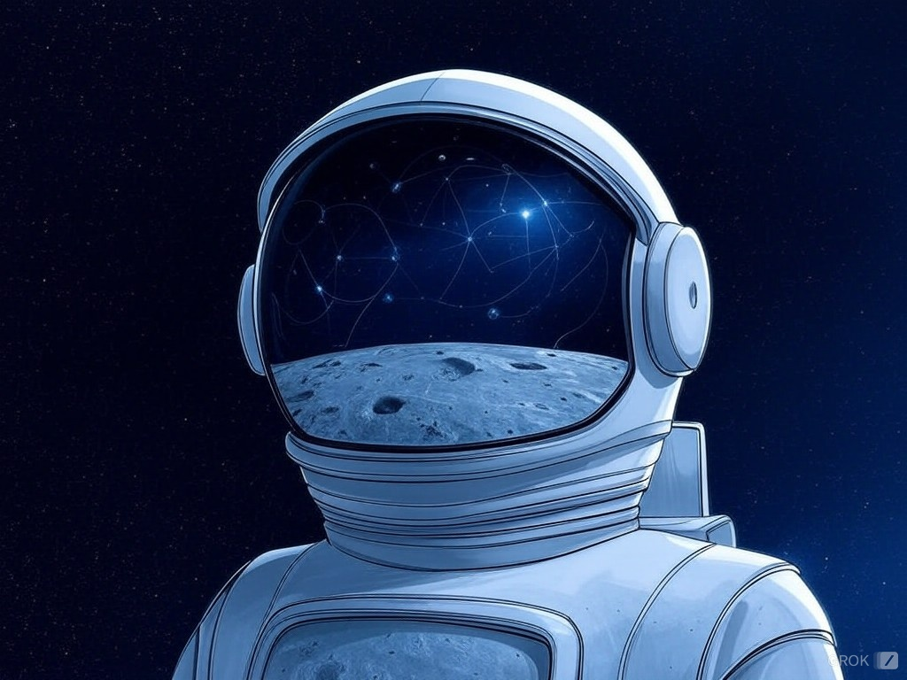

<div align="center">

# Apollo：大型多模态模型中的视频理解探索

<p align="center">
    
<p>


<a href="https://arxiv.org/abs/2412.10360" target="_blank">
    
</a>
<a href="https://apollo-lmms.github.io" target="_blank">
    
</a>
<br>
<a href="https://huggingface.co/Apollo-LMMs" target="_blank">
    
</a>
<a href="https://huggingface.co/spaces/Apollo-LMMs/Apollo-3B" target="_blank">
    
</a>
<a href="https://huggingface.co/spaces/Apollo-LMMs/ApolloBench" target="_blank">
    
</a>

</div>


Apollo 是一个旨在解决广泛视频-语言任务的大型多模态模型（LMMs）系列，包括长视频理解、时间推理和多轮视频对话。Apollo 在多个基准测试中实现了最先进的性能，并能够高效地从数十亿扩展到数百亿参数。

## 发布信息
- **[2024年12月13日]** Apollo 正式发布！
- **[即将推出...]** 训练代码将在获得内部批准后发布。

## 快速开始

### 安装

```bash
pip install -e .
pip install flash-attn --no-build-isolation
```

### 下载模型

```bash
git lfs install
git clone https://huggingface.co/GoodiesHere/Apollo-LMMs-Apollo-7B-t32
```

### 推理示例

```python
import torch
from transformers import AutoModelForCausalLM
from apollo.mm_utils import (
    KeywordsStoppingCriteria,
    tokenizer_mm_token,
    ApolloMMLoader
)
from apollo.conversations import conv_templates, SeparatorStyle
from apollo.constants import X_TOKEN, X_TOKEN_INDEX
from huggingface_hub import snapshot_download

# Parameters
version = "qwen_2"
model_url = "Apollo-LMMs/Apollo-3B-t32"
model_path = snapshot_download(model_url, repo_type="model")

video_path = "/your/local/path/video.mp4"
question = "Describe this video in detail"
temperature = 0.4
top_p = 0.7
max_output_tokens = 256

device = "cuda" if torch.cuda.is_available() else "cpu"
attn_implementation = "sdpa" if torch.__version__ > "2.1.2" else "eager"

model = AutoModelForCausalLM.from_pretrained(
    model_path,
    trust_remote_code=True,
    low_cpu_mem_usage=True,
    attn_implementation=attn_implementation,
).to(device=device, dtype=torch.bfloat16)

tokenizer = model.tokenizer
vision_processors = model.vision_tower.vision_processor
config = model.config
max_length = config.llm_cfg['model_max_length']
num_repeat_token = config.mm_connector_cfg['num_output_tokens']
mm_use_im_start_end = config.use_mm_start_end

frames_per_clip = 4
clip_duration = getattr(config, 'clip_duration')

mm_processor = ApolloMMLoader(
    vision_processors,
    clip_duration,
    frames_per_clip,
    clip_sampling_ratio=0.65,
    model_max_length=config.model_max_length,
    device=device,
    num_repeat_token=num_repeat_token
)

model.eval()

mm_data, replace_string = mm_processor.load_video(video_path)
message = replace_string + "\n\n" + question

conv = conv_templates[version].copy()
conv.append_message(conv.roles[0], message)
conv.append_message(conv.roles[1], None)
prompt = conv.get_prompt()

input_ids = tokenizer_mm_token(prompt, tokenizer, return_tensors="pt").unsqueeze(0).to(device)

pad_token_ids = tokenizer.pad_token_id if tokenizer.pad_token_id is not None else tokenizer.eos_token_id
stop_str = conv.sep if conv.sep_style != SeparatorStyle.TWO else conv.sep2
keywords = [stop_str]
stopping_criteria = KeywordsStoppingCriteria(keywords, tokenizer, input_ids)

with torch.inference_mode():
    output_ids = model.generate(
        input_ids,
        vision_input=[mm_data],
        data_types=['video'],
        do_sample=(temperature > 0),
        temperature=temperature,
        max_new_tokens=max_output_tokens,
        top_p=top_p,
        use_cache=True,
        num_beams=1,
        stopping_criteria=[stopping_criteria]
    )

pred = tokenizer.batch_decode(output_ids, skip_special_tokens=True)[0].strip()
print(pred)
```

### PEFT（参数高效微调）
- **(即将推出...)** 我们将提供如何将低秩适应（LoRA）和其他参数高效微调技术应用于 Apollo 的示例和文档。


## 引用

如果您在研究中使用了 Apollo，请引用：
```bibtex
@article{apollo,
    title={Apollo: An Exploration of Video Understanding in Large Multimodal Models},
    author={Orr Zohar, Xiaohan Wang, Yann Dubois, Nikhil Mehta, Tong Xiao, Philippe Hansen-Estruch, Licheng Yu, Xiaofang Wang, Felix Juefei-Xu, Ning Zhang, Serena Yeung-Levy, and Xide Xia},
    journal={arXiv preprint arXiv:2412.10360},
    year={2024}
}
```